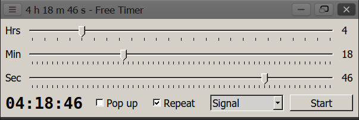

# Free-Timer
A simple Free Pascal application with GUI (qt5) for GNU/Linux to create a sound signal or power off / reboot the system automatically after a specified time.

To create a sound signal the `paplay` utility (PulseAudio) is used. Make sure you have installed the `pulseaudio-utils` package from your repository:
`sudo apt-get install pulseaudio-utils`

The sound file `alarm.wav` should be located in the program directory.

You can download the executable file `freetimer` and `alarm.wav` on the [release page](https://github.com/ap13ski/Free-Timer/releases/tag/main). 

Lazarus 2.0.0 (qt5) - Debian package.

